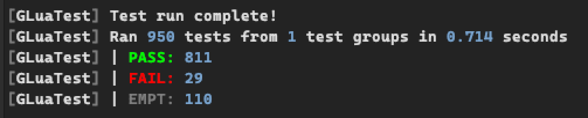
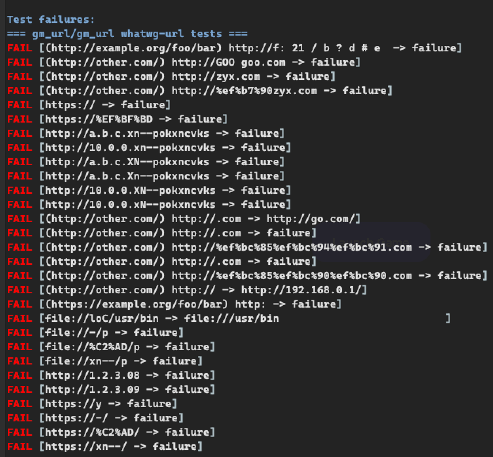

# gm_url
Fast and *almost (97%)* [spec-compliant with whatwg-url](https://url.spec.whatwg.org/) URL parser library written in pure Lua! 

*P.S. By saying "pure lua" I mean LuaJIT :P*
<br>
*P.S.S. I hate punycode*
<br>
*P.S.S.S. see a [part about spec complience below](#about-spec-compliancy)*

## Features
- [x] [URL class](https://url.spec.whatwg.org/#url-class) API that is similiar to [Javascript's URL class](https://developer.mozilla.org/en-US/docs/Web/API/URL)
- [x] Fully featured [URLSearchParams class](https://url.spec.whatwg.org/#interface-urlsearchparams)
- [x] Fully covers specification *but not the [IDNA](https://www.unicode.org/reports/tr46/tr46-31.html)*
- [x] Fast even without any 🦀 Rust code 🚀
- [x] Basic API parsing functions so you build your own URL class 💪
- [x] Easily integratable, just drop [the file](url.yue), require it and get everything you want!
- [x] Absolute overkill that beats everyone else's implementations 😈

And now about bad things:
- [ ] Many fields may be `nil`, while in Javascript they are always `string`
- [ ] `port` fields is a `number` instead of a `string`
- [ ] Does not implement [IDNA](https://www.unicode.org/reports/tr46/tr46-31.html) by spec, but believe me it won't bother you

And as far I remember that's all!
<br>
*Talking about this library like it is some spaceship, anyway I am proud about this library :P*

## Wait! Where is `.lua` file???
Hey, I know you are confused, but it is fine. The library was written in [Yuescript](https://github.com/pigpigyyy/Yuescript)
that itself is a somewhat successor to [Moonscript](https://github.com/leafo/moonscript), language that is transpiled to Lua.

But you don't need to transpile anything, just grab [url.lua from here](https://github.com/Pika-Software/gm_url/blob/lua/url.lua), or extract it from the [latest release](https://github.com/Pika-Software/gm_url/releases/latest)

You also may want to ask why not just in Lua. Well, plain Lua sucks, and Yuescript brings joy into coding because of syntax-sugar
it provides. Definetely try it out!

Oh, and if you are Yuescript/Moonscript enthusiast in Garry's Mod community, then you should try out [gm_moonloader ❤️](https://github.com/Pika-Software/gm_moonloader)

## Example
```lua
local URL = require("url").URL

local baseUrl = "https://developer.mozilla.org"

local A = URL("/", baseURL)
-- => 'https://developer.mozilla.org/'

local B = URL(baseURL)
-- => 'https://developer.mozilla.org/'

URL("en-US/docs", B)
-- => 'https://developer.mozilla.org/en-US/docs'

local D = URL("/en-US/docs", B)
-- => 'https://developer.mozilla.org/en-US/docs'

URL("/en-US/docs", D)
-- => 'https://developer.mozilla.org/en-US/docs'

URL("/en-US/docs", A)
-- => 'https://developer.mozilla.org/en-US/docs'

URL("/en-US/docs", "https://developer.mozilla.org/fr-FR/toto")
-- => 'https://developer.mozilla.org/en-US/docs'
```

## API
```lua
class URL
    -- Creates a new URL object and parses given url with given base
    -- Note: it is URL(url, base)
    new(url: string, base?: string)
    
    -- also calling tostring(...) with URL given will result in getting full url (aka .href)

    href: string -- full url
    origin: string? -- *readonly* origin of the url ¯\_(ツ)_/¯
    scheme: string? -- just a plain scheme
    protocol: string? -- a scheme with ':' appended at the end
    username: string?
    password: string?
    hostname: string?
    host: string -- hostname + port
    port: number?
    pathname: string?
    query: string?
    search: string -- a query with '?' prepended
    searchParams: URLSearchParams -- *readonly*
    fragment: string?
    hash: string? -- a fragment with '#' prepended

    -- Just a table with raw values that are used in the parser
    state: URLState

-- Same as calling URL(url, base)
URL URL.parse(url: string, base?: string)
-- Returns true if given string with base can be parsed
bool URL.canParse(url: string, base?: string)

-- Returns true if given obj is URL
bool IsURL(obj: any)

class URLSearchParams
    -- if `init` is table, then it must be a list that consists of tables 
    -- that have two value, name and value
    -- e.g. { {"name", "value"}, {"foo", "bar"}, {"good"} }
    -- Note: it is URLSearchParams(init, url)
    new(init: string/table/nil, url: URL?)

    -- also calling tostring(...) with URLSearchParams given will result in getting serialized query

    -- appends name and value to the end
    append(name: string, value: string?)
    -- searches all parameters with given name, and deletes them
    -- if `value` is given, then searches for exactly given name AND value
    delete(name: string, value: string?)
    -- finds first value associated with given name
    string/nil get(name: string)
    -- finds all values associated with given name and returns them as list
    table getAll(name: string)
    -- returns true if parameters with given name exists
    -- and value if given
    bool has(name: string, value: string?)
    -- sets first name to a given value (or appends [name, value])
    -- and deletes other parameters with the same name
    set(name: string, value: string?)
    -- sorts parameters inside URLSearchParams
    sort() 

    -- returns iterator that can be used in for loops
    -- for example:
    --
    -- for k, v in searchParams:iterator()
    --     ...
    --
    iterator iterator() -- key, value
    iterator keys() -- key
    iterator values() -- value

-- Returns true if given obj is URLSearchParams
bool IsURLSearchParams(obj: any)

-- Percent-encode/decode methods 
string encodeURI(uri: string) -- see https://developer.mozilla.org/en-US/docs/Web/JavaScript/Reference/Global_Objects/encodeURI
string encodeURIComponent(uri: string) -- see https://developer.mozilla.org/en-US/docs/Web/JavaScript/Reference/Global_Objects/encodeURIComponent
string decodeURI(uri: string) -- see https://developer.mozilla.org/en-US/docs/Web/JavaScript/Reference/Global_Objects/decodeURI
string decodeURIComponent(uri: string) -- see https://developer.mozilla.org/en-US/docs/Web/JavaScript/Reference/Global_Objects/decodeURIComponent

-- Basic URL parsing/serializing functions that are used in URL class
URLState parse(obj: URLState, url: string, base: string?) -- returns the same obj that it was given
string serialize(obj: URLState, excludeFragment: bool = false) -- same as URL.href

-- Just a table that may have fields defined below
interface URLState
    scheme: string?
    username: string?
    password: string?
    hostname: string/table/number/nil
    port: number?
    path: string/table/nil
    query: string/URLSearchParams/nil
    fragment: string?
```

## About spec-compliancy§
The only part of this library that is not spec-compliant is [IDNA processing](https://www.unicode.org/reports/tr46/tr46-31.html) because I am too lazy to spend time on this.


Here is rate how much tests pass / fail


And here is what tests exactly failed. As you can see everything is related to IDNA/Punycode. 
Since it is only 3% of all tests I don't even bother to fix it unless **REALLY** needed.


*`urltestdata.json` was taken from [web-platform-tests](https://github.com/web-platform-tests/wpt/tree/master/url/resources)*
